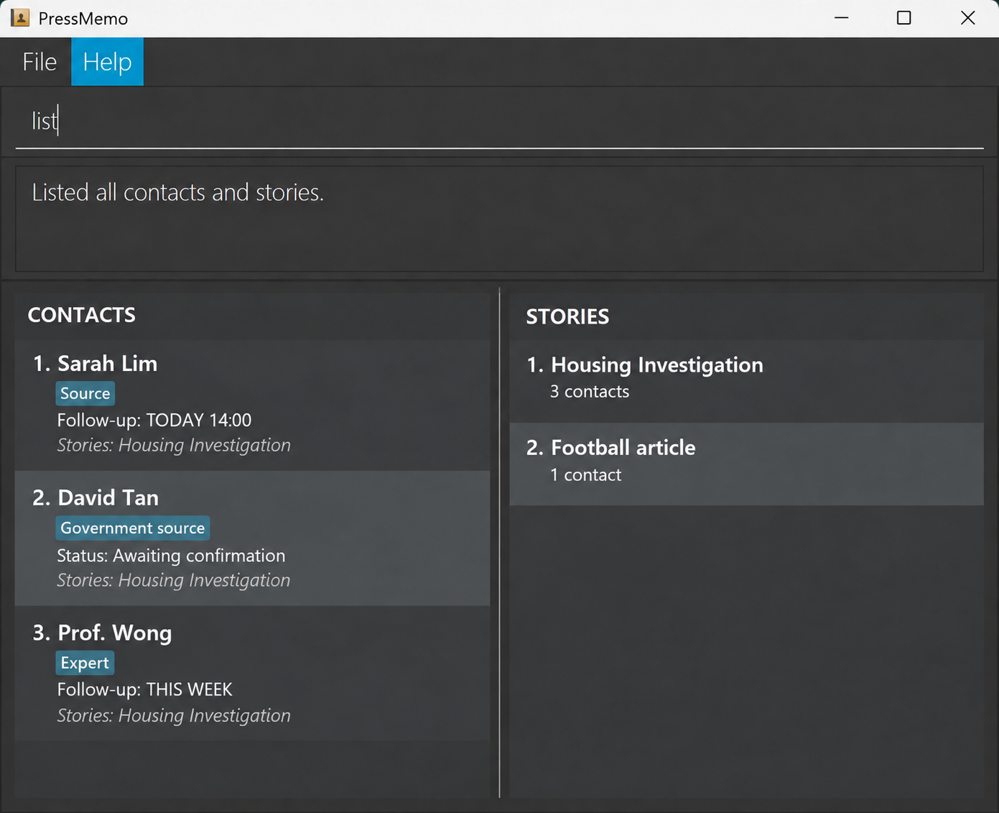

# PressMemo

## Problem Statement

Journalists manage many contacts across several stories, often while working under tight deadlines. It can be difficult to recall who to contact and why they are relevant. PressMemo is a command-line workspace for organizing contacts and managing stories.

## Target Audience

Journalists and reporters who manage multiple sources and stories, and prefer using a command-line interface (CLI).

## Features to Implement

- Add, list, and delete contact records.
- Create and list stories, and delete stories that are no longer active.
- Assign contacts to stories and remove those associations.
- Find contacts associated with a story and view the stories associated with a contact.

This project is based on the AddressBook-Level3 project created by the [SE-EDU initiative](https://se-education.org).
