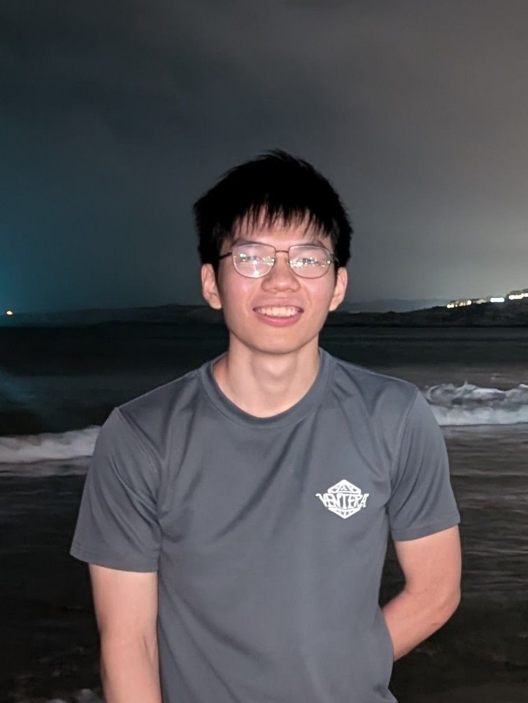
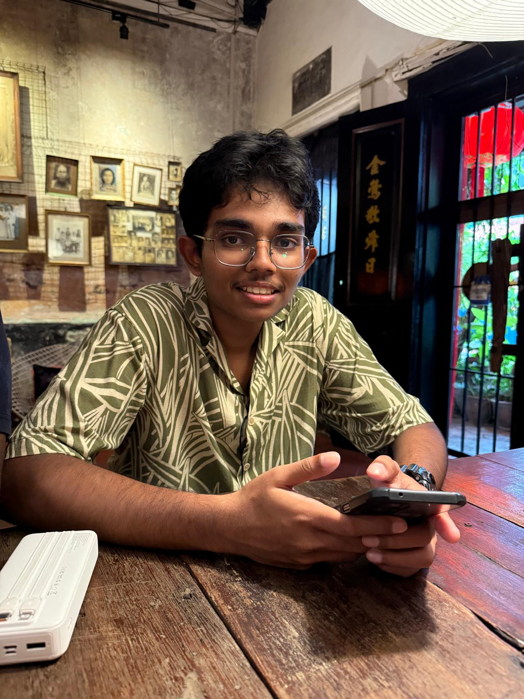
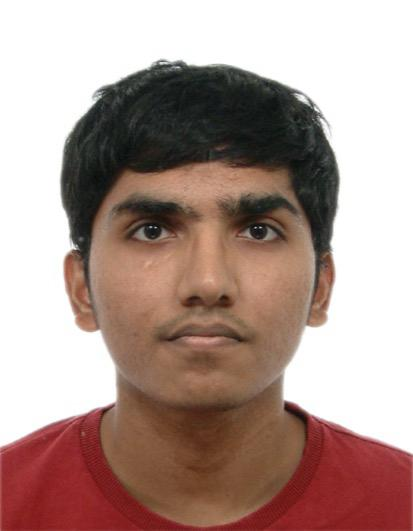

We are a team based in the [School of Computing, National University of Singapore](https://www.comp.nus.edu.sg).

You can reach us at the email `seer[at]comp.nus.edu.sg`

## Project team

### Zheng Yong

[[github](https://github.com/ZYS-37)]

* Role: Code Quality IC
* Responsibilities: Ensure code quality standards

### Krithic

[[github](http://github.com/krit004)]

* Role: Integrations IC
* Responsibilities: Help integration of merges for team members

### Pu Yu

[[github](http://github.com/johndoe)] [[portfolio](team/johndoe.md)]

* Role: Developer
* Responsibilities: Data

### Linus

[[github](http://github.com/johndoe)]
[[portfolio](team/johndoe.md)]

* Role: Developer
* Responsibilities: Dev Ops + Threading

### Nithesh

[[github](https://github.com/Heshtin)]

* Role: Documentation IC
* Responsibilities: Documentation
